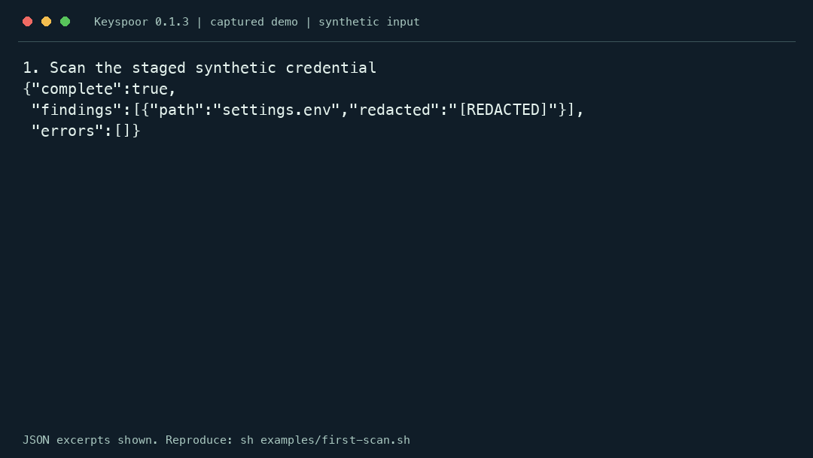

# Keyspoor

**Offline secret scanning for AI coding workflows.**
Keyspoor scans files, staged Git changes, local Git history and ZIP/tar/gzip
archives, with redacted JSON, JSONL and SARIF results. Use it as a native CLI,
a reusable Rust library or a read-only MCP server. Connect agents through MCP;
use a staged hook or a required CI check to block commits or merges.

[Website](https://majiayu000.github.io/keyspoor/) ·
[Rust API](https://docs.rs/keyspoor) ·
[crates.io](https://crates.io/crates/keyspoor) ·
[npm](https://www.npmjs.com/package/keyspoor) ·
[Releases](https://github.com/majiayu000/keyspoor/releases) ·
[简体中文](README.zh-CN.md)

## Try it in 60 seconds

With Node.js 20+, paste this into a macOS/Linux terminal. The value below is
made up for this demo and is not a credential:

```sh
printf 'password=KspDemo_7zQ2mX9pL4vN6sR8\n' | npx -y keyspoor@0.1.3 scan - --format json
echo "exit=$?"
```

Expected: `exit=1` and one finding. The relevant report fields are:

```json
{"complete":true,"findings":[{"rule_id":"generic-credential-unquoted","path":"stdin","line":1,"column":9,"redacted":"[REDACTED]"}],"errors":[]}
```

This is an excerpt; the actual report also includes ranges, fingerprints,
statistics and scan context. It contains neither the value nor a source snippet.
On Windows PowerShell, pipe the same synthetic string to
`npx.cmd -y keyspoor@0.1.3 scan - --format json`, then check `$LASTEXITCODE`.

### Watch a commit get blocked, then repaired



With Git and an installed `keyspoor` CLI, run the complete demo from a checkout:

```sh
sh examples/first-scan.sh
```

It creates and deletes its own temporary repository. The recording comes from
an actual 0.1.3 run with invented input: finding exit **1**, blocked commit,
repair exit **0**, accepted commit. No agent is involved in this hook demo.
[MCP setup](docs/AGENT_SETUP.md) gives agents tools; it does not guarantee they
call them before each commit. [CI and hooks](docs/CI_SETUP.md) provide enforcement.

| Your goal | Start here |
| --- | --- |
| Scan a repository or staged changes | [CLI commands](#cli-and-repository-scans) |
| Block pull requests and save a report | [Complete CI setup](docs/CI_SETUP.md) · [copyable workflow](examples/github-actions/keyspoor.yml) |
| Give a coding agent scanning tools | [Codex, Claude Code and Cursor setup](docs/AGENT_SETUP.md) |
| Embed a scanner in Rust | [Library example](#library-and-custom-rules) · [Rust API](https://docs.rs/keyspoor) |

## Install

```sh
# Rust toolchain (1.96 or newer)
cargo install keyspoor --version 0.1.3 --locked

# Or Node.js 20+: the npm package runs the native Rust CLI
npm install -g keyspoor@0.1.3

# Or Homebrew (macOS / Linux)
brew install majiayu000/tap/keyspoor

keyspoor scan . --format jsonl
```

Current release: **0.1.3**. The Rust API is pre-1.0 and may change. The npm
package bundles native binaries for macOS (Apple Silicon/Intel), Linux GNU
(ARM64/x64) and Windows x64; it is a CLI launcher, not a JavaScript scanning SDK.
There are no install hooks or runtime binary downloads. First-time npm/npx
installation requires registry access; scanning itself is offline.
[Standalone binaries](https://github.com/majiayu000/keyspoor/releases) are also
available. To build from source, run `cargo build --release --locked` and use
`target/release/keyspoor`.

## Why Keyspoor

- **Offline by design:** scanning does not call credential providers, and reports
  omit raw secrets and source snippets.
- **Reusable Rust engine:** compile rules once and share an `Engine` across calls
  and threads; no scanner SDK dependency.
- **Agent interfaces:** MCP `scan_text` / `scan_paths`, persistent JSONL requests,
  progress and cancellation, plus explicit incomplete-scan reporting.
- **Repository-aware inputs:** staged index contents, local Git history, bounded
  archive expansion, ignore files and fingerprint baselines.
- **Evidence you can inspect:** versioned rules, documented exclusions and
  reproducible quality, throughput and allocation measurements.

The matching, keyword dispatch, filtering, decoding, location mapping, Git
acquisition and agent interfaces are implemented here. This project does not
depend on Kingfisher or another secret scanner SDK. It uses general-purpose
Rust regex, Aho–Corasick, hashing and archive libraries.

The built-in catalog contains 221 rules adapted from the MIT-licensed Gitleaks
v8.30.1 catalog plus four independently written rules (three generic assignment
rules and one URI-password rule), for 225 rules in the default engine.
See [rule provenance and exclusions](docs/RULE_SOURCES.md) and
[third-party notices](THIRD_PARTY_NOTICES). This is not a Gitleaks-compatible
engine: rule semantics that cannot be preserved are explicitly excluded.
The [implementation decision](docs/DECISIONS.md) records the build/adapt boundary
and rejected SDK and wrapper alternatives.

## CLI and repository scans

```sh
keyspoor scan /path/to/project --format json
keyspoor staged /path/to/repository
keyspoor history /path/to/repository
keyspoor history /path/to/repository --range main..HEAD
keyspoor scan - --format jsonl
keyspoor scan /path/to/project --write-baseline baseline.json
keyspoor scan /path/to/project --baseline baseline.json
keyspoor rules
keyspoor serve
keyspoor mcp --root /path/to/project
```

Exit codes: **0** means the selected scan completed with no reported findings;
**1** means it completed with findings; **2** means an error or incomplete scan.
You can check both other outcomes with synthetic input:

```sh
printf 'ordinary configuration\n' | npx -y keyspoor@0.1.3 scan - --format json
echo "exit=$?" # 0: complete=true, findings=[]
printf 'ordinary configuration\n' | npx -y keyspoor@0.1.3 scan - --max-bytes 4 --format json
echo "exit=$?" # 2: complete=false, errors contains "input exceeds 4 byte limit"
```

When a finding appears, inspect its path and position locally, remove exposed
credentials from tracked files and rotate any real credential that was exposed.
Review known intentional findings before recording a baseline. Investigate every
`2` result before treating the scan as complete.

An ignored finding is not evidence that the original input contained no secret.
Baselines suppress existing fingerprints but preserve changed secret values.
An incomplete scan cannot replace a baseline. Baseline schema 2 binds the scan
mode, canonical roots, effective ignore policy (including Git/Jujutsu repository
boundaries), size budget and engine settings
(including rule content and fingerprint key identity). A different scope or
policy cannot compare against or overwrite that baseline. Create a separate
baseline when intentionally changing policy. Schema 1 baselines are rejected.
Canonical filesystem identity makes aliases such as `./` stable; reported paths
and rule path predicates remain relative to the selected source root.

Every finding is redacted and contains a rule, path, byte range, one-based line,
zero-based byte column, confidence, explanation and fingerprint. No raw secret
or source snippet is serialized. The default unkeyed fingerprint is a digest,
not encryption and not protection against guessing low-entropy secrets. Supply
`--fingerprint-key-file` with exactly 32 private bytes for keyed BLAKE3 identities.
Keep the same private key when comparing baselines.

Exact matches at the same secret byte span within one decoded view are merged.
`rule_id` identifies the primary rule: non-`generic-` IDs take precedence, then
higher confidence, then lexical rule ID. Merged findings include sorted
`matched_rule_ids` containing the primary and other matching rules; single-rule
findings omit that field. Adjacent occurrences, partial overlaps and distinct
positions inside one Base64 container stay separate. The primary rule determines
the fingerprint. This semantic update changes the engine configuration identity,
so previous baselines must be explicitly recreated rather than compared silently.

Scanning never contacts credential providers or validates whether a credential
is active. Filesystem scans respect ignore files by default; `--no-ignore`
includes ignored files, while Git metadata remains excluded. Oversized inputs
are reported as incomplete, not clean. Default file and archive expansion limits
are 64 MiB; `--max-bytes` changes the budget. Archive traversal never writes
members to disk. ZIP, tar and gzip have a shared expansion budget and at most
four nesting levels. Encrypted or damaged members remain visible as errors.

Staged mode reads the **index** version of each changed file, not the working
tree. It scans whole staged files to preserve credential-pair context. History
mode scans locally reachable commits, reads each unique blob once and retains
commit/path occurrences. It does not fetch LFS, submodules or remote refs, and
also unpacks supported archives in Git blobs, retaining commit/member paths. `stats.files/bytes` count
unique inputs; `detection_passes` counts actual path-sensitive engine calls.

## GitHub Action

Copy the [complete pull request workflow](examples/github-actions/keyspoor.yml)
into `.github/workflows/keyspoor.yml`, or follow the [CI setup guide](docs/CI_SETUP.md)
for reports, permissions, baselines and failure handling. Its scan job can be
required in branch protection. The core steps are:

```yaml
permissions:
  contents: read
steps:
  - uses: actions/checkout@v7
  - uses: majiayu000/keyspoor@v1
    id: secrets
    with:
      path: .
      format: sarif
  - uses: actions/upload-artifact@v7
    if: always() && steps.secrets.outputs.report-path != ''
    with:
      name: keyspoor-report
      path: ${{ steps.secrets.outputs.report-path }}
```

Place these steps in a job. The Action installs the exact npm package version
recorded at its source ref, scans the selected path and saves a redacted report
outside the checkout. `report-path` points to that file; `exit-code` preserves
0 (clean), 1 (findings), or 2 (error/incomplete). Findings and errors fail the
step; reports may be incomplete after an error. Use a full commit SHA to pin
the Action immutably instead of the maintained `v1` ref. Supported report
formats are SARIF (default), JSON and JSONL. Installation needs npm registry
access; detection itself remains offline. The Action scans files; use the CLI
for staged/history modes and custom engine options.

Releases publish through [GitHub Actions](.github/workflows/release.yml) with
npm and crates.io trusted publishing. Homebrew updates in the existing tap
run hourly and may be delayed by GitHub scheduling. See the
[release guide](docs/RELEASING.md) for triggers and verification.

## Library and custom rules

Add `keyspoor = "0.1"` and `anyhow = "1"` to your dependencies for this example.

```rust
use keyspoor::{Engine, EngineConfig};

fn main() -> anyhow::Result<()> {
    let engine = Engine::new(EngineConfig::default())?;
    let findings = engine.scan_bytes("config.env", b"ordinary configuration")?;
    assert!(findings.is_empty());
    Ok(())
}
```

Reuse an engine across calls and threads to avoid repeated compilation. It does
not install a global runtime, logger or executor.

`Finding.path` and `Finding.explanation` are shared `Arc<str>` values. This is a
breaking Rust API change from `String`: use `.into()` when assigning an owned
string, `.as_ref()` to read `&str`, and replace the field to change its text.
JSON still contains ordinary strings; fingerprints, scan context and baseline
identity are unchanged. Generated findings share paths within one engine scan
and explanations across calls using the same engine. Deserialization does not
intern repeated strings.

Custom JSON rule files use
`{"rules": [...]}` and can be supplied with `--rules path.json` or a rules
directory. `--no-builtin` selects only custom rules. Each rule has `id`, `name`,
`pattern`, optional `secret_group`, `keywords`, `min_entropy`, `confidence`,
`path`, `allowlist` and `exclude_paths`. Keywords are case-insensitive OR-ed
necessary conditions; rules without keywords are always considered. Allowlist
groups have `condition` (`or`/`and`), `target` (`secret`/`match`/`line`),
`regexes`, `paths`, and `stopwords`. Groups are OR-ed; predicates within one
category are OR-ed, then populated categories are combined using `condition`.
Stopwords are case-insensitive substrings of the secret. Empty groups fail.
Omitted/null `secret_group` selects the first nonempty capture (or whole match);
explicit `0` selects the whole match. These rule-schema changes are breaking.
Unknown rule
fields and invalid regexes fail visibly. Rule patterns are never echoed in
compilation errors. Custom rule descriptions and identifiers are trusted
configuration and should not contain real secrets.

Generic API/access/auth token assignments suppress long explanatory prose
(at least eight words plus sentence/clause punctuation). This heuristic does not
suppress natural-language password/secret assignments, but a real token formatted
as a long punctuated phrase can still be missed. Provider rules retain upstream
limitations; see the rule provenance document.

## Agent interfaces

Start with the [tested configuration guide for Codex, Claude Code and Cursor](docs/AGENT_SETUP.md).
MCP exposes read-only tools; whether an agent calls them depends on the client,
its permissions and the task. Use a required CI check or Git hook when scans
must run before changes are accepted.

`serve` accepts one JSON object per line: `{"id":1,"path":"file.txt","text":"..."}`.
Responses contain the same id and a complete redacted scan report. Rules are
compiled once. Malformed JSON returns an error without echoing the payload;
an oversized request terminates this simple stream.

The MCP stdio server supports initialization, ping, tool listing and calls to
`scan_text` and `scan_paths`. File paths must resolve beneath the configured
root. The server does not perform writes or network verification. Root checks
are not an OS sandbox against another local process replacing paths concurrently.
MCP errors and tool failures are distinct, and malformed/oversized frames do not
turn into successful clean results. stdout contains protocol messages only.
One scan runs at a time while ping and cancellation remain responsive. Clients
may supply a progress token and cancel by request id; cancelled requests receive
no final response, and the session remains usable. Cancellation is checked at
file, Git blob and archive-member boundaries (also archive read chunks), not
inside a single regex operation. Tool results include at most 100 findings and
100 errors within a shared 512 KiB entry budget, plus total counts and
`output_truncated`; truncation is independent of scan completeness.

JSON, JSONL and SARIF are available. Ordinary filesystem/Git JSONL scans emit
`finding`, `error` and `progress` records during scanning, followed by a `summary`
with counts and completeness. Bounded worker queues avoid collecting all file
reports; output errors stop further acquisition. Each worker still buffers one
input and its findings, and Git history metadata remains resident. JSON/SARIF,
stdin, and JSONL scans using baselines collect reports; baseline validation must
finish before filtered results are emitted. SDK callers can use the `scan_*_stream`
APIs with `ScanControl` and a fallible event sink. Regular progress is emitted at
most once per 100 ms, with first and final snapshots retained. These are
event-driven updates, not a heartbeat during a single long regex operation.
The CLI flushes its first finding and each error immediately; later findings use
buffered writes, and progress/final records flush remaining output.

## Verification and comparison

```sh
cargo fmt --check
cargo test --locked
cargo clippy --all-targets --locked -- -D warnings
python3 -m unittest discover -s bench -p test_run.py
python3 bench/fixtures/generate.py --self-test
python3 scripts/import_rules.py --check
python3 -m unittest discover -s bench -p test_holdout.py
python3 -m unittest discover -s scripts -p test_stress_benchmark.py
python3 scripts/check_package.py --allow-dirty
```

[Benchmark methodology and reproduction](bench/README.md) separates synthetic
labelled quality from unlabelled real-source throughput. Versions, commands,
hardware, binary fingerprints, time, memory, parser completeness and unsupported
capabilities are retained. Online verification is disabled. These measurements
do not establish production accuracy or universal speed leadership.

The latest [v6 allocation and performance report](bench/results/v6/README.md)
measured 20 alternating before/after pairs on Apple M2 Max/macOS. For one
100,000-finding synthetic JSONL workload, scanner peak RSS fell from 99.86 to
59.59 MiB and scanner CPU time fell 8.74%; regular throughput and Git workloads
were broadly unchanged. These are changes within this project, not competitor
speed rankings. Previously observed synthetic regression sets retained
600 true positives, 25 false positives and zero false negatives; this is not a
real-world precision estimate.

See [measured results](docs/RESULTS.md), the
[versioned cross-tool comparison](bench/results/v4/quality-comparison.md),
[comparison methodology](bench/README.md) and
[feature-by-feature research](docs/FEATURES.md). The research covers 22 external
projects; unsupported, unavailable and cloud-dependent entries are identified
rather than scored as failures. Historical artifacts call this project
`secret-scan`, its name before Keyspoor; their recorded commands and binary
hashes have been preserved.

[Feature implementation matrix](docs/FEATURES.md) maps every item in the research
catalog to implemented, partial or unimplemented status. Cloud connectors,
credential validation/revocation, GPU/ML backends and language bindings are not
implied by the presence of a CLI or MCP server.

## License and support

Keyspoor is [Apache-2.0 licensed](LICENSE). Adapted rule data retains its upstream
MIT license and attribution in [THIRD_PARTY_NOTICES](THIRD_PARTY_NOTICES).
Report reproducible bugs or request features in
[GitHub Issues](https://github.com/majiayu000/keyspoor/issues); use synthetic
examples and do not include real credentials.
